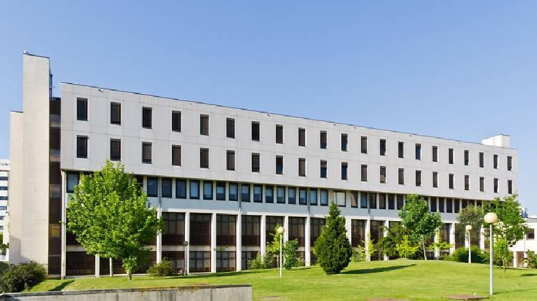
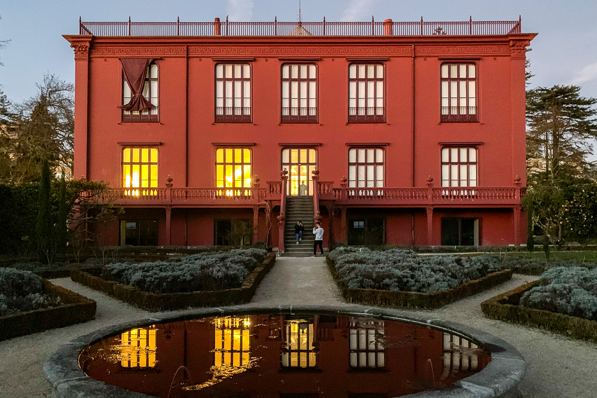

Porto is a fascinating and vibrant city that has so much to offer as a holiday or city break destination. The city boasts an extensive history, unique tourist attractions, delicious cuisines and buzzing nightlife. Porto has a delightful historic centre and is famed for its Port wine, but it is also a young and energetic city, with social nightlife, liberal attitudes and a flourishing artisan scene. Take a look at [this page](https://porto-north-portugal.com/) for a quick guide of the city. The workshop is expected to take place at the __Department of Computer Science of the Faculty of Sciences of the University of Porto__ and lunches will likely be served at a close by restaurant [__Maria Dentada__](https://mariadentada.pt/).

<!-- ![Venues][image1] -->

    
      

 

## Getting There…
{: .secondHSp}

The nearest airport to the city of Porto is the [Sá Carneiro Airtport](https://www.portoairport.pt/en/opo/home). From there, you can pick one of many efficient public transportation networks at your service on [this page](https://www.portoairport.pt/en/opo/access-parking/getting-to-and-from-the-airport/public-transportation) to get to the venue.

We recommend taking [metro line E](https://www.metrodoporto.pt/metrodoporto/uploads/document/file/471/mapa_de_rede.pdf) at the [Aeroporto](https://maps.app.goo.gl/p2xoDjdeTDc9NT2b8) metro station (located at the airport), and exiting at the [Casa da Música](https://maps.app.goo.gl/Gm31VVZcCVe35fup9) metro station. From there, you can either: walk to the [venue](https://maps.app.goo.gl/9x8aPVrpP67SxG9Q7) (aprox. 21 min); or take the 204 or 209 bus line available at the [Casa da Música (Metro)](https://maps.app.goo.gl/zAzWsKbPgXgX8XSu9) bus station and exiting at the [Faculdade de Ciências](https://maps.app.goo.gl/w5akohJYTGuZQXxv5) bus station. From there, you will find clear instruction guiding you to the [venue](https://maps.app.goo.gl/9o5Wsu14QGicC98Y7).

<!-- Lunches will be served at the [Círculo Universitário do Porto](https://maps.app.goo.gl/rMyojFJLTR7qU5gbA). -->

<!-- You can find the location of the airport, all relevant metro and bus stations, and the venue on the map below. In order to navigate around the city center, we recommend using your favorite GPS navigation app. -->

<!-- ## Social Event -->

For further information, please contact one of the local organizers.

<!-- General Organization: José Proença -->

- [José Proença](https://jose.proenca.org)
- ...

<!-- 

       
    

   
 

## Social Event

       
    

 

  
Banquet and excursion: the XX excursion will include a visit YY. We will visit ZZ. Moreover, the XX banquet will be served in ZZ.
 -->
